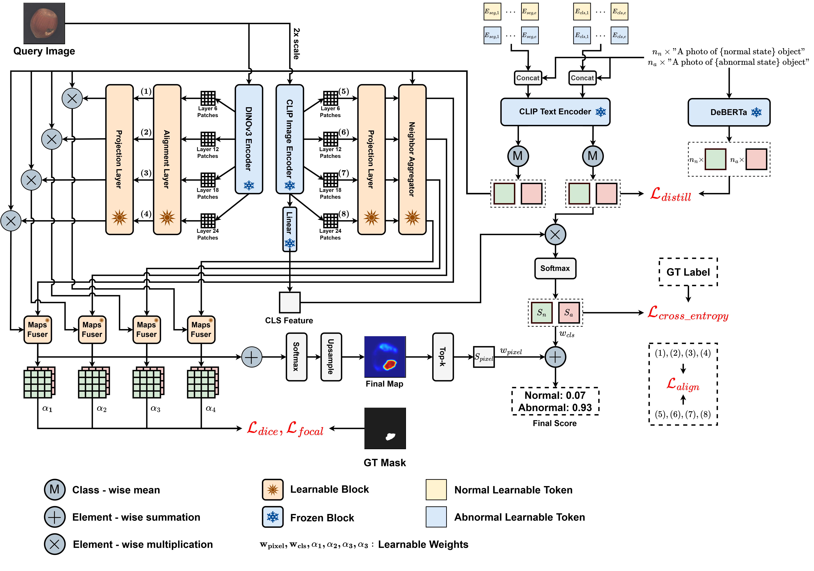
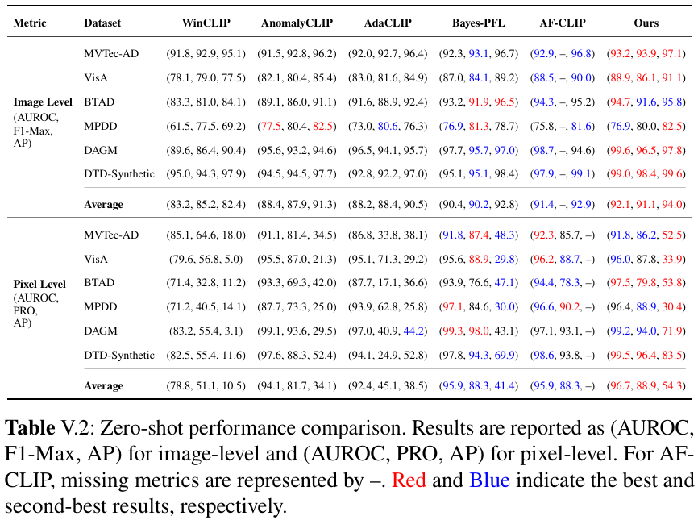
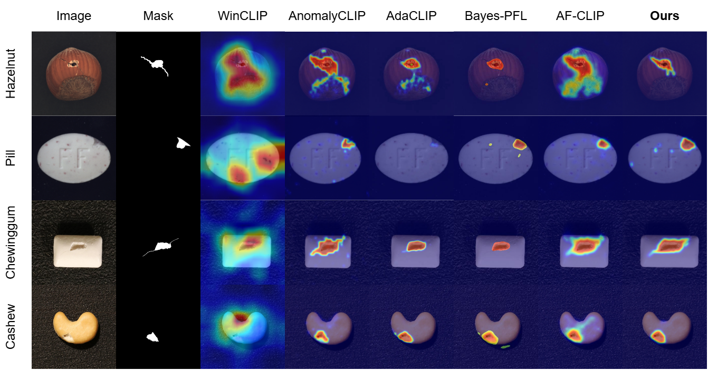

# CLIP-based Industrial Anomaly Detection Framework

This repository provides a framework for training and evaluating anomaly detection models on various datasets including MVTec-AD, VisA, BTAD, DTD-Synthetic, DAGM, and MPDD.

## I. Project Overview

This project trains and evaluates a CLIP-based industrial anomaly detection model. It uses a shared dataset index at `data/data/data.json`, so every dataset is exposed to the dataloader through the same metadata format.

## II. Project Contributors

### 1. University

Viet Nam National University Ho Chi Minh City - Ho Chi Minh City University of Technology

### 2. Instructors

- LE HONG TRANG, ASSOC. PROF.
- DUONG DUC TIN, M.S.

### 3. Students

- Le Minh Trung - 2252854
- Le Phong Hao - 2252182

## III. Main Architecture



## IV. Project Results





## V. Setup Environment

### 1. Create Virtual Environment

```bash
python -m venv venv
# Windows:
venv\Scripts\activate
# Linux/macOS:
source venv/bin/activate
```

### 2. Install Dependencies

```bash
pip install -r requirements.txt
```

## VI. Data Preparation

### 1. Automatic Preparation

The framework uses a centralized index (`data/data/data.json`) for all datasets. To download and prepare the data automatically:

```bash
python data/prep.py
```

**Supported Datasets**: `MVTec-AD`, `VisA`, `BTAD`, `DAGM`, `MPDD`, `DTD`.

This script downloads, extracts, and indexes all supported datasets into `data/data/`. You can also prepare one dataset at a time:

```bash
python data/scripts/mvtec.py
python data/scripts/visa.py
python data/scripts/btad.py
python data/scripts/dagm.py
python data/scripts/mpdd.py
python data/scripts/dtd.py
```

### 2. Manual Fallback Layouts

If `data/prep.py` or one of the dataset-specific scripts fails, prepare the dataset folders manually under `data/data/`, then rerun the matching script to rebuild `data/data/data.json`. The dataloader reads `image_path` and `mask_path` values from this JSON file, relative to `data/data/`.

#### 2.1 Root Data Repository

```text
data/
|-- data/
|   |-- data.json
|   |-- mvtec_anomaly_detection/
|   |-- visa/
|   |-- btad/
|   |-- dagm/
|   |-- mpdd/
|   `-- dtd/
`-- scripts/
    |-- mvtec.py
    |-- visa.py
    |-- btad.py
    |-- dagm.py
    |-- mpdd.py
    `-- dtd.py
```

#### 2.2 MVTec-AD

Expected root: `data/data/mvtec_anomaly_detection/`

```text
mvtec_anomaly_detection/
|-- bottle/
|   |-- train/
|   |   `-- good/
|   |       |-- 000.png
|   |       `-- ...
|   |-- test/
|   |   |-- good/
|   |   |   |-- 000.png
|   |   |   `-- ...
|   |   |-- broken_large/
|   |   |   |-- 000.png
|   |   |   `-- ...
|   |   `-- ...
|   `-- ground_truth/
|       |-- broken_large/
|       |   |-- 000_mask.png
|       |   `-- ...
|       `-- ...
|-- cable/
|-- capsule/
`-- ...
```

#### 2.3 VisA

Expected root: `data/data/visa/`

VisA is indexed from `split_csv/1cls.csv`, so keep the official image, mask, and CSV paths together.

```text
visa/
|-- split_csv/
|   `-- 1cls.csv
|-- candle/
|   |-- Data/
|   |   |-- Images/
|   |   |   |-- Normal/
|   |   |   `-- Anomaly/
|   |   `-- Masks/
|   |       `-- Anomaly/
|   `-- ...
|-- capsules/
|-- cashew/
`-- ...
```

Each row in `split_csv/1cls.csv` must include the columns used by `data/scripts/visa.py`: `object`, `split`, `label`, `image`, and `mask`.

#### 2.4 BTAD

Expected root: `data/data/btad/`

```text
btad/
|-- 01/
|   |-- Test/
|   |   |-- ok/
|   |   |   |-- 000.png
|   |   |   `-- ...
|   |   |-- defect_type/
|   |   |   |-- 000.png
|   |   |   `-- ...
|   |   `-- ...
|   `-- ground_truth/
|       `-- defect_type/
|           |-- 000.png
|           `-- ...
|-- 02/
`-- 03/
```

The script also accepts lowercase `test`, normal folders named `good`, and mask folders named `ground_truth`, `gt`, or `GroundTruth`.

#### 2.5 DAGM

Expected root: `data/data/dagm/`

```text
dagm/
|-- Class1/
|   `-- Test/
|       |-- 0001.PNG
|       |-- 0002.PNG
|       |-- Label/
|       |   |-- 0002_label.PNG
|       |   `-- ...
|       `-- ...
|-- Class2/
`-- Class10/
```

DAGM images without a matching file in a `Label/` folder are treated as normal. Images with a matching label mask are treated as abnormal.

#### 2.6 MPDD

Expected root: `data/data/mpdd/`

```text
mpdd/
|-- bracket_black/
|   |-- test/
|   |   |-- good/
|   |   |   |-- 000.png
|   |   |   `-- ...
|   |   |-- defect_type/
|   |   |   |-- 000.png
|   |   |   `-- ...
|   |   `-- ...
|   `-- ground_truth/
|       `-- defect_type/
|           |-- 000_mask.png
|           `-- ...
|-- bracket_brown/
|-- bracket_white/
|-- connector/
|-- metal_plate/
`-- tubes/
```

The script also accepts `Test`, normal folders named `ok`, and mask folders named `ground_truth`, `gt`, or `GroundTruth`.

#### 2.7 DTD-Synthetic

Expected root: `data/data/dtd/`

```text
dtd/
|-- category_name/
|   |-- test/
|   |   |-- good/
|   |   |   |-- 000.png
|   |   |   `-- ...
|   |   |-- defect_type/
|   |   |   |-- 000.png
|   |   |   `-- ...
|   |   `-- ...
|   `-- ground_truth/
|       `-- defect_type/
|           |-- 000_mask.png
|           `-- ...
`-- ...
```

DTD-Synthetic follows the same `test/` and `ground_truth/` pattern as MVTec-style datasets.

#### 2.8 Metadata Index

The `data/data/data.json` file should contain one top-level key per dataset: `mvtec`, `visa`, `btad`, `dagm`, `mpdd`, and `dtd`. Each category stores samples in this format:

```json
{
  "mvtec": {
    "bottle": [
      {
        "image_path": "mvtec_anomaly_detection/bottle/test/broken_large/000.png",
        "mask_path": "mvtec_anomaly_detection/bottle/ground_truth/broken_large/000_mask.png",
        "is_normal": false,
        "is_train": false
      },
      {
        "image_path": "mvtec_anomaly_detection/bottle/train/good/000.png",
        "mask_path": null,
        "is_normal": true,
        "is_train": true
      }
    ]
  }
}
```

`mask_path` should be `null` for normal images or for datasets without pixel masks. `is_train` should be `true` only for training samples.

## VII. Training

The `train.py` script handles the training process. By default, it saves checkpoints to `./checkpoints/train_{dataset}/model_{seed}.pth`.

### 1. Basic Usage

```bash
python train.py --dataset visa --epochs 2 --lr 1e-4 --batch_size 8 --gpus cuda:0
```

### 2. Distributed Training

Use `torchrun` for faster training across multiple GPUs:

```bash
torchrun --nproc_per_node=2 train.py --dataset visa --batch_size 8 --gpus cuda:0 cuda:1
```

**Key Arguments**:

- `--dataset`: Choose from `mvtec`, `visa`, `btad`, `dagm`, `mpdd`, `dtd`.
- `--split`: Dataset split to use (`train`, `test`, or `all`).
- `--epochs`: Number of training epochs (default: 2).
- `--seed`: Random seed for reproducibility.

## VIII. Testing

The `test.py` script evaluates a model checkpoint on a specific dataset and calculates Image/Pixel-level metrics (AUROC, AP, F1, PRO).

### 1. Usage Example

```bash
# Evaluate MVTec using a checkpoint trained on VisA
python test.py --dataset mvtec --ckpt_path checkpoints/train_visa/model_123.pth --gpus cuda:0
```

**Key Arguments**:

- `--ckpt_path`: Path to the `.pth` checkpoint.
- `--sigma`: Gaussian blur sigma for anomaly map smoothing (default: 4.0).
- `--n_vis`: Number of images to visualize and log to WandB per category (default: 50).

## IX. Automated Pipeline

The `run.sh` script automates a full evaluation cycle, including cross-dataset training and testing over multiple iterations with random seeds.

### 1. Usage

```bash
# Run 10 iterations on 2 GPUs
bash run.sh --gpus cuda:0 cuda:1 --n_run 10
```

**What it does**:

1. **Initializes**: Clears the `results/` directory.
2. **Cycle A**: Trains on `VisA` and evaluates on `MVTec`.
3. **Cycle B**: Trains on `MVTec` and evaluates on all other datasets (`VisA`, `BTAD`, `DAGM`, `MPDD`, `DTD`).
4. **Repetition**: Repeats the above for `$N` runs, generating unique seeds for each iteration.

## X. Monitoring and Results

- **Weights & Biases**: Training loss and evaluation visualizations (heatmaps) are logged to WandB. Ensure you are logged in (`wandb login` or export `WANDB_API_KEY`).
- **Local Results**: Metrics for every run are saved as JSON files in `results/{dataset}/{seed}.json`.

## XI. Project Structure

- `train.py` and `test.py`: Core execution scripts.
- `run.sh`: Master pipeline script.
- `model/`: Model architecture (`ProposeModel`) and sub-modules.
- `data/`: Dataset scripts and preparation logic.
- `utils/`: Distributed setup, metrics calculation, and utility functions.
- `checkpoints/`: Model weights storage.
- `results/`: Evaluation JSON storage.

## XII. References

This project borrows some code implementation from the following papers: CLIP, WinCLIP, DINOv3, DeBERTa-V3, AnomalyCLIP.

- [2] A. Radford et al., "Learning transferable visual models from natural language supervision", Feb. 2021.
- [3] J. Jeong, Y. Zou, T. Kim, D. Zhang, A. Ravichandran, and O. Dabeer, "Winclip: Zero-/few-shot anomaly classification and segmentation", Mar. 2023.
- [4] Q. Zhou, G. Pang, Y. Tian, S. He, and J. Chen, Anomalyclip: Object-agnostic prompt learning for zero-shot anomaly detection, 2025.
- [15] O. Simeoni et al., "Dinov3", 2025.
- [16] P. He, X. Liu, J. Gao, and W. Chen, "Deberta: Decoding-enhanced bert with disentangled attention", in International Conference on Learning Representations, 2021.
- [17] P. He, J. Gao, and W. Chen, Debertav3: Improving deberta using electra-style pre-training with gradient-disentangled embedding sharing, 2021.
